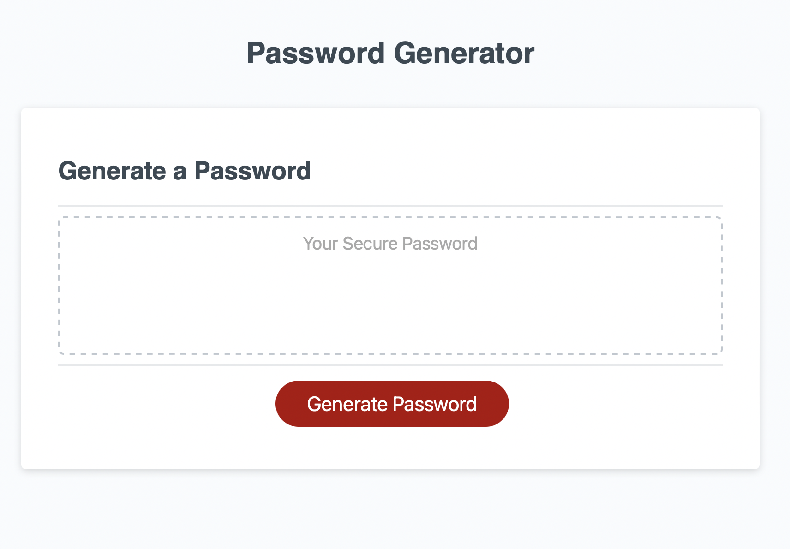

# derekson-unh-project3
This is Dan Erekson's third homework challenge for UNH coding bootcamp
The completed challenge is a website that can be used to generate a random secure password with a length between 8 and 128 characters. The user can also select the type of characters to include when generating the password.

The site is deployed at https://derekson333.github.io/derekson-unh-project3/

Github repository at https://github.com/derekson333/derekson-unh-project3